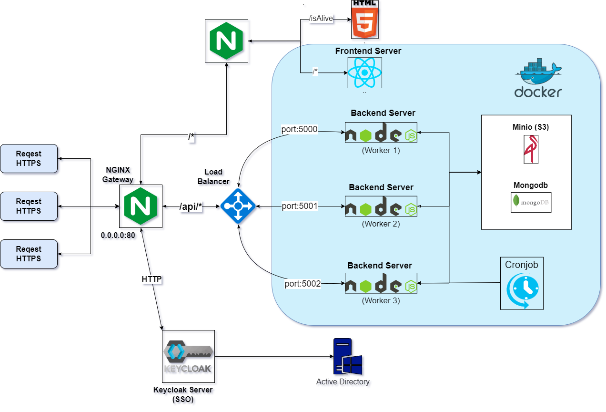

# Employee Management Web Project

## Overview

The Employee Management Web Project is a comprehensive, user-friendly platform designed to streamline the organization and maintenance of employee data within companies. The application is tailored to meet the needs of organizations of various sizes, currently serving approximately 1,500-2,000 end users.

## Features

- **Employee Profiles:** Maintain detailed profiles for each employee, including personal information, job title, department, achievements, strengths, weaknesses, and career development plans.
- **Hierarchical Management:** Manage employees efficiently based on the company's hierarchical structure, allowing managers and team leaders to oversee their subordinates and access relevant information.
- **File Management:** Upload and manage files relevant to employee performance and career growth, such as performance reviews, project documents, and training materials.
- **Notes:** Record observations, feedback, and any other pertinent information on employee performance, facilitating communication between managers and their team members.
- **Visibility Control:** Control the visibility of information, allowing employees access to selected data based on managerial preferences, maintaining privacy when needed.
- **Onboarding Support:** Facilitate the integration of new team leaders by providing access to comprehensive employee work history, ensuring a smooth transition and enhancing team cohesion.
- **Automatic Cronjob**: Implement an automatic cronjob to periodically update the application with the latest data from the database, ensuring that users always have access to the most recent information.

## Version

This is a prototype version of the project. Please note that the current implementation may not include all intended features or be fully optimized, as it is still under development. The final version of the project will not be available to the general public.

## Architecture:

## Getting Started:

### Prerequisites:

- A modern web browser (e.g., Google Chrome, Mozilla Firefox, Safari)
- Node.js and npm installed on your local machine

### Installation:

1. Clone the repository:
   git clone https://github.com/yarinhd/Employee-Management-Web-Project.git
2. Navigate to the project directory and install the required dependencies:
   cd employee-management-web-project
   npm install
3. Set up the necessary environment variables in a .env file in the project's root directory, following the .env.example file as a template.
4. Start the development server:
   npm run dev

The application should now be accessible at http://localhost:3000 in your web browser.

## Usage:

1. **Registration:** As a new user, register for an account by providing your name, email address, and password.
2. **Authentication:** Log in to the application using your registered email address and password.
3. **Dashboard:** Access the main dashboard, where you can view and manage employee data, including profiles, files, and notes.
4. **Search:** Use the search functionality to find specific employees or filter employees based on department, job title, or other criteria.
5. **Settings:** Adjust your personal settings and preferences, including visibility settings for employee data

## Usage:

I welcome contributions from the community! To contribute, please follow these steps:

- Fork the repository
- Create a new branch with a descriptive name for your feature or bugfix
- Commit your changes to the new branch
- Submit a pull request from your forked repository to the original repository
  Please also feel free to report bugs, request new features, or provide feedback by creating an issue in the GitHub repository
